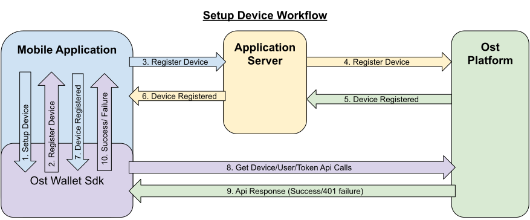

# Ost Wallet SDK React Native

## Introduction

Ost React Native Wallet SDK is the official Ost Wallet SDK for react-native platform. The SDK is a mobile application development SDK that enables developers to integrate the functionality of a non-custodial crypto-wallet into consumer applications. 

Ost React Native Wallet SDK...

* Safely generates and stores keys on the user's mobile device
* Signs ethereum transactions and data as defined by contracts using EIP-1077
* Enables users to recover access to their Brand Tokens in case the user loses their authorized device


## Table of Contents
* [Installing React-native SDK](#installing-react-native-sdk)
* [Migrating to another version](#migrating-to-another-version)
* [SDK Usage](#sdk-usage)
  + [Initializing the SDK](#initializing-the-sdk)
  + [Initializing SDK With Config](#initializing-sdk-with-config)
  + [Subscribe to `OstWalletSdkEvents` in your top most level component](#subscribe-to--ostwalletsdkevents--in-your-top-most-level-component)
* [Getter Methods](#getter-methods)
* [Ost JSON APIs](#ost-json-apis)
* [Quick Start Guide - Ost Macro Workflows](#quick-start-guide---ost-macro-workflows)
  + [Setup Device Core Workflow](#setup-device-core-workflow)
    - [Workflow Details](#workflow-details)
    - [Notes](#notes)
    - [Implementation](#implementation)
  + [Activate User UI Workflow](#activate-user-ui-workflow)
    - [Blockchain Transactions Performed During Activate User Workflow](#blockchain-transactions-performed-during-activate-user-workflow)
    - [Recovery Key Generation Using 6 Digit Pin](#recovery-key-generation-using-6-digit-pin)
    - [Implementation](#implementation-1)
  + [Wallet Settings UI Component](#wallet-settings-ui-component)
    - [Implementation](#implementation-2)
  + [Redemption flow UI Component](#redemption-flow-ui-component)
    - [Implementation](#implementation-3)
  + [OstTransactionHelper - Transaction and Session Integrated Workflow](#osttransactionhelper---transaction-and-session-integrated-workflow)
    - [Implementation](#implementation-3)
* [Intermediate Usage - Ost Wallet SDK UI](#intermediate-usage---ost-wallet-sdk-ui)
* [Advance Usage - Ost Wallet Core Workflow APIs](#advance-usage---ost-wallet-core-workflow-apis)
* [Known Issues](#known-issues)
  + [Sdk Initialization Fails on Android 9](#sdk-initialization-fails-on-android-9-api-level-28)
  + [Setup Device Workflow Fails on iOS-13 Simulator](#setup-device-workflow-fails-on-ios-13-simulator)


## Installing React-native SDK

1. Install React Native and create a react-native project

Follow this [official react-native getting started guide](https://facebook.github.io/react-native/docs/0.59/getting-started) to install react native and create a react-native project

2. Install Ost React Native SDK in your project
The sdk needs following peer dependencies:
* [eventemitter3](https://www.npmjs.com/package/eventemitter3)
* [lodash.merge](https://www.npmjs.com/package/lodash.merge)
* [bignumber.js](https://www.npmjs.com/package/bignumber.js)

```bash
  npm install --save lodash.merge
  npm install --save eventemitter3
  npm install --save bignumber.js
```

Run following command in your react-native project root

```bash
 npm install --save @ostdotcom/ost-wallet-sdk-react-native
```

3. Linking the Ost React Native SDK with your project

```bash
 react-native link @ostdotcom/ost-wallet-sdk-react-native
```

4. [Android set-up for Ost React Native SDK](./documentation/android_setup.md)

5. [iOS Set-up for Ost React Native SDK](./documentation/ios_setup.md)

## Migrating to another version
If you decide to change the SDK version, please make sure to update the downsteam native SDKs.

For Android, please run:
```shell
react-native link
react-native run-android
```

For iOS, please update the `ios/Cartfile` with desired version and run:
```shell
carthage update --cache-builds --platform ios
```
After updating the SDK, please delete `ostwalletrnsdk` using the **Remove References** option and add it back by following [this step](./documentation/ios_setup.md#5-add-additional-sdk-files).

## SDK Usage
* Initialize the SDK
* Subscribe to events
* Implement `OstWalletWorkFlowCallback` for a workflow
* Execute workflow

### Initializing the SDK
You must initialize the SDK before using it.
> Initialize the SDK in using BASE_URL (Ost Platform endpoint) inside App.js `constructor()` method.

```javascript
/**
   * Initialize wallet sdk
   * @param {String} endpoint - Ost Platform endpoint
   * @param {function} Callback function with error and success status.
   * @public
   */
  OstWalletSdk.initialize( endpoint, 
            (error, success) => {})
```

### Initializing SDK With Config
Starting version `2.3.1` application can also pass SDK config in the initialize method
> If config is passed in `initialize` method, the configs specified in `OstWalletSdk.plist` and `ost-mobilesdk.json` are ignored. 
> It is no longer mandatory to define `ost-mobilesdk.json` and `OstWalletSdk.plist` files.

```javascript
  let sdkConfig = {
    "BLOCK_GENERATION_TIME": 3,
    "PIN_MAX_RETRY_COUNT": 3,
    "REQUEST_TIMEOUT_DURATION": 60,
    "SESSION_BUFFER_TIME": 3600,
    "PRICE_POINT_CURRENCY_SYMBOL": "USD",
    "USE_SEED_PASSWORD": false,
    "NO_OF_SESSIONS_ON_ACTIVATE_USER": 1,
    "ENABLE_IOS_DEVICE_RESTORE": false
  };

  /**
  * Initialize wallet sdk
  * @param {String} endpoint - Ost Platform endpoint
  * @param {Object} config (optional) - SDK Config. Supported from version 2.3.1
  * @param {function} callback -   A typical node-style, error-first callback.
  * @callback params {Object}error , {Boolean} success
  * @public
  */
  OstWalletSdk.initialize( endpoint, sdkConfig, (error, success) => {

  });
```

### Subscribe to `OstWalletSdkEvents` in your top most level component

In the most top level component (mostly `App.js`) import like this:
```javascript
import { OstWalletSdkEvents, OstWalletSdk, OstWalletSdkUI, OstJsonApi } from '@ostdotcom/ost-wallet-sdk-react-native';
```

In `componentDidMount()` subscribe to OstWalletSdkEvents and in `componentWillUnmount()` unsubscribe to OstWalletSdkEvents. Also initialize the SDK in using BASE_URL (Ost Platform endpoint) `constructor()` method:

```javascript
class App extends Component {
    
  constructor() {
    super();
    OstWalletSdk.initialize(BASE_URL, (error, success) => {
      if(error) {
        console.warn(error);
      }
      else {
        console.warn(success);
      }

    });
  }

  componentDidMount() {
    OstWalletSdkEvents.subscribeEvent();
  }

  componentWillUnmount() {
    OstWalletSdkEvents.unsubscribeEvent();
  }

}
```

## Getter Methods
The SDK provides getter methods that applications can use for various purposes. 
These methods provide the application with data as available in the device's database.
Please refer to [Ost Wallet SDK Getter Methods](./documentation/OstWalletSdkGetMethods.md) for documentation.

## Ost JSON APIs
While the getter methods provide application with data stored in device's database, the JSON API methods make API calls to Ost Platform servers. 
Please refer to [Ost JSON API](./documentation/OstJsonApi.md) for documentation.

## Quick Start Guide - Ost Macro Workflows
Starting version 2.3.12-beta.1, developers can enable all the Ost wallet features implementing the Ost Macro Workflows.

### 1. Setup Device Core Workflow
---
The setup device workflow establishes trust between the device and Ost Platform. As application is responsible for user authentication, application servers must facilitate this workflow using the server side sdk.

#### Workflow Details
* When this workflow is initiated by the application, the Sdk creates the following keys:
  - API key - the key used to sign API requests sent to Ost Platform from the sdk.
  - Device key - the user's wallet device key. All device manager operations shall be performed using this key.
* The Sdk asks the application to register the device entity with Ost Platform.
* The application must send the device entity to the application server.
* The application server must then use the server side sdk to register the device with Ost Plaform by using device service's create device Api.
* Once the device is registered by the Ost Platform, the application server must send the response to the mobile application.
* The mobile application must then use the `deviceRegistered` callbacks to provide the response to the Sdk.
* The sdk validates the registration by making Api calls to the Ost Plaform.



#### Notes
* Setup device workflow must be initiated **on every app launch**.
* Setup device workflow must be initiated only **after the user has been autheniticated** by the application, including cookie based authentication for already logged-in users.
* Each of user’s device creates its own API key and device key.
* User’s Device and API keys are not shared across devices.
* User’s API key & device key are stored in persistent storage on the device and created only if needed.
* The Sdk shall request for device registration only when needed. `registerDevice` shall not be invoked if device is already authorized and sdk is able to make Api calls to Ost Platform.

#### Implementation
Please refer to [`setupDevice` core workflow documentation](./documentation/OstCoreWorkflows.md#setupdevice) for implementation details.

### 2. Activate User UI Workflow
---
Activate User workflow deploys user's wallet on the blockchain and whitelists the user's wallet and enables it to take part in application's brand token economy.

#### Blockchain Transactions Performed During Activate User Workflow
* Deploys user’s contracts
  - Device-manager and token-holder contracts
  - Set user’s recovery key address, device key address in device-manager contract
  - Authorizes session key(s) in token-holder contract
* Whitelists user’s contract in UBT (Utility Brand Token Contract).

#### Recovery Key Generation Using 6 Digit Pin
* User's recovery key is generated using [SCrypt](https://en.bitcoinwiki.org/wiki/Scrypt), a password-based key derivation function.
* The ‘password’ provided to this function is a string created by concatenating:
* A prefix provided by application server. 
> Application server must generate and store prefix for each user, treat it as sensitive and immutable information.
* User’s PIN
* User’s Ost-id
* The salt required for SCrypt is provided by Ost Platform

#### Implementation
Please refer to [Activate User UI Workflow Documentation](./documentation/OstWalletUI.md#activate-user) for implementation details.

### 3. Wallet Settings UI Component 
---
OstWallet Settings is a pre-built UI component available exclusively available in `ost-wallet-sdk-react-native` SDK.
It is a wallet settings page that can be used by end-users to perfrom 12 different wallet operations and view their wallet details.
> <b>IMPORTANT:</b> This feature requires application to use [React Navigation](https://reactnavigation.org/docs/en/getting-started.html) package.

#### Implementation
Please refer to [OstWallet Settings Documentation](./documentation/OstWalletSettings.md) for implementation details.

### 4. Redemption Flow UI Component
OstRedemption component is a pre-built UI component available exclusively in `ost-wallet-sdk-react-native` SDK.
It consist two pages - one displaying redeemable product list and another displaying product details and redemption options. It can be used by end-users to integrate redemption flow into their app.
> <b>IMPORTANT:</b> This feature requires application to use [React Navigation](https://reactnavigation.org/docs/en/getting-started.html) package.

#### Implementation
Please reder to [OstRedemption flow Documentation](./documentation/OstRedemptionFlow.md) for implementation details.

### 5. OstvTransaction Helper - Transaction and Add Session Integrated Workflow
---
`OstTransactionHelper` is a transaction helper provided by the SDK that creates session keys before performing a transaction if needed. App developers can configure the session creation parameters (session buckets) as per application's need.

#### Implementation
Please refer to [Ost Transaction Helper Documentation](./documentation/OstTransactionHelper.md) for implementation details.

## Intermediate Usage - Ost Wallet SDK UI
For quick and easy integration with SDK, developers can use built-in user-interface components which are configurable and support content and theme customization. 

Please refer to [Ost Wallet SDK UI ](./documentation/OstWalletUI.md) for documentation.

## Advance Usage - Ost Wallet Core Workflow APIs
Ost core workflows API do not use any UI components, thereby giving complete ux control to the developers. The [`OstWalletSdkUI`](./documentation/OstWalletUI.md) also uses Ost core workflows.

Please refer to [Ost Core Workflow APIs](./documentation/OstCoreWorkflows.md) for documentation.

## Known Issues

### Sdk Initialization Fails on Android 9 (API level 28)
Starting with Android 9 (API level 28), [cleartext support](https://developer.android.com/training/articles/security-config#CleartextTrafficPermitted) is disabled by default. On the other hand, Ost Wallet Android Sdk leverages on **Public Key Pinning** to ensure the authenticity of a Ost Platform server's public key used in TLS sessions using [TrustKit](https://github.com/datatheorem/TrustKit-Android). As TrustKit can only be inititialized with application's [network security configuration](https://developer.android.com/training/articles/security-config), sdk initialization fails. To work-around this issues, application needs to have TrustKit as a dependency and initialize it. 

### Setup Device Workflow Fails on iOS-13 Simulator
Ost Wallet Sdk uses iOS's [Keychain](https://developer.apple.com/documentation/security/certificate_key_and_trust_services/keys/storing_keys_in_the_keychain) to store user's cryptographic keys. Unfortunately, Keychain doesn't work as expected on iOS-13 Simulators. We request you to kindly test your application on actual iOS-13 device while we continue to look for a workaround.

