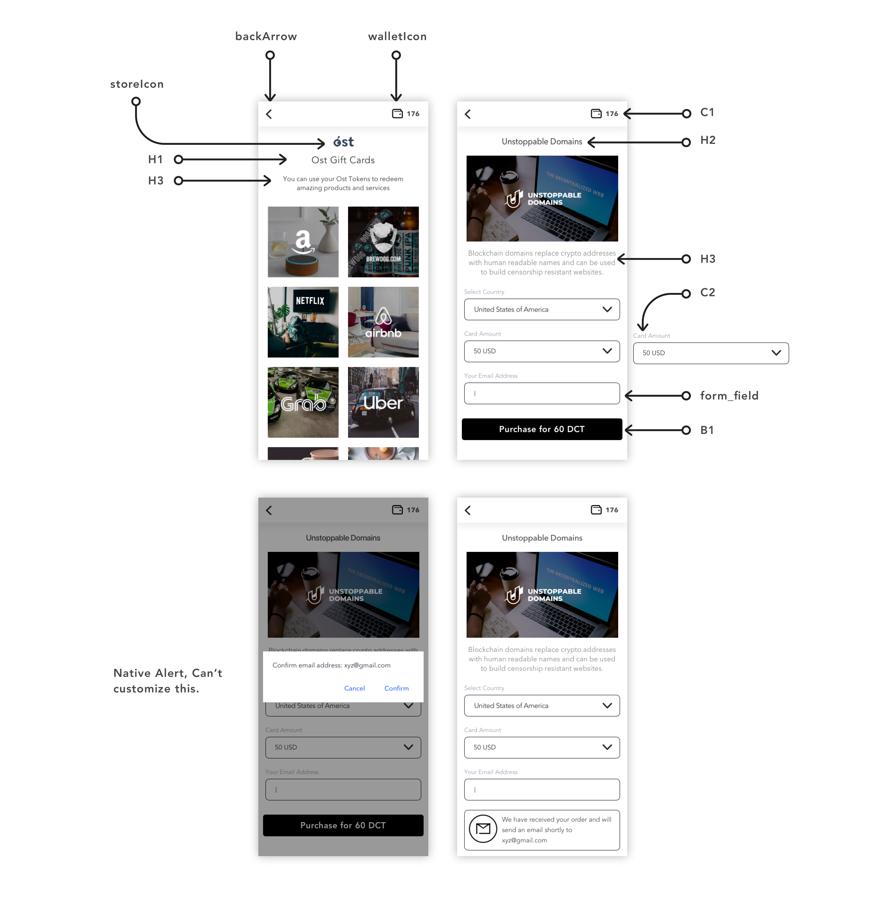

# OstRedemption Flow

## Introduction

OstRedemption component is a pre-built UI component available exclusively in `ost-wallet-sdk-react-native` SDK.
It consist two pages - one displaying redeemable product list and another displaying product details and redemption options. It can be used by end-users to integrate redemption flow into their app.
> <b>IMPORTANT:</b> This feature requires application to use [React Navigation](https://reactnavigation.org/docs/en/getting-started.html) package.

## Usage

### Create Redemption Flow stack navigation

```js
import {OstRedeemableSkus, OstRedeemableSkuDetails } from '@ostdotcom/ost-wallet-sdk-react-native';

let redemptionStack = createStackNavigator(
  {
    RedeemableSkusScreen: OstRedeemableSkus,
    RedeemableSkuDetails: OstRedeemableSkuDetails
  }
);
```

### Navigate to settings page
`ostUserId` and `ostWalletUIWorkflowCallback` are mandetory parameters that need to be passed as params to the `RedeemableSkusScreen` screen.
```js
const ostUserId = <APPLICATION-USER-OST-USER-ID>
const delegate = new OstWalletUIWorkflowCallback(ostUserId, {})
this.props.navigation.push("RedeemableSkusScreen", {'ostUserId': ostUserId ,
                                                        'ostWalletUIWorkflowCallback': delegate,
                                                        'navTitle': 'My Store'});
```

><b>Note</b> <br/>
> Developer needs to create a class extends from `OstWalletUIWorkflowCallback` and write logic to get passphrase prefix from their application server.
> Please refer [this](OstWalletUI.md#setup-your-passphrase-prefix-delegate) section for documentation.

## UI Customization

Developer can customize Redemption flow by updating respective properties mentioned in image. OstTheme config shown [here](./configs/ost-sdk-theme-config.js)



## Settings Content

Developer can make various modifications in redemption flow component. To modify contet, [refer here](./OstWalletSettingsConfig.md).

```js
import {OstWalletSdkUI} from "@ostdotcom/ost-wallet-sdk-react-native/js/index";

let ost_sdk_theme_config = {}

OstWalletSdkUI.setThemeConfig(ost_sdk_theme_config);
```


