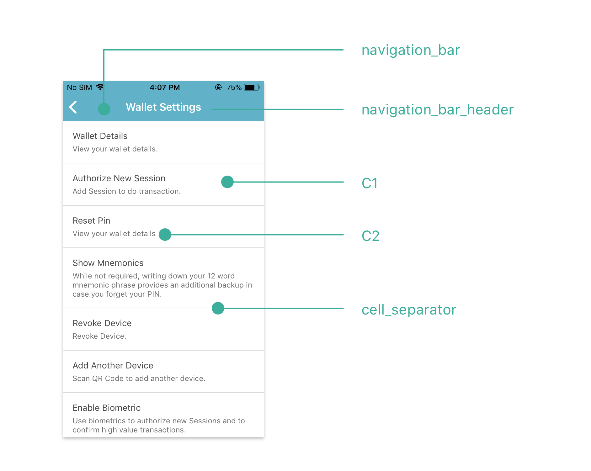
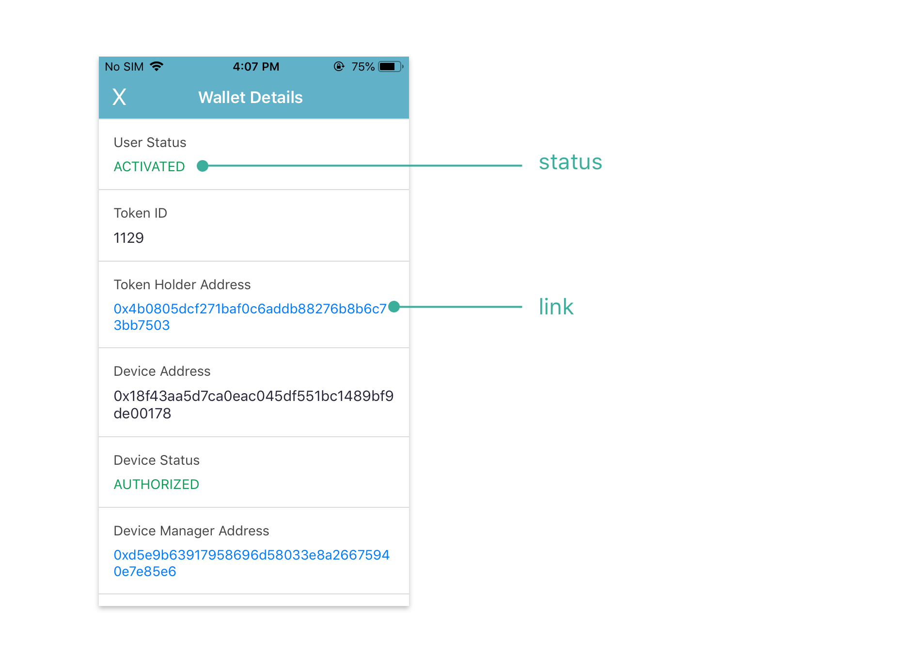

# OstWallet Settings

## Introduction

OstWallet Settings is a pre-built UI Component available exclusively available in `ost-wallet-sdk-react-native` Sdk.
It is a wallet settings page that can be used by end-users to perfrom different wallet operations.
> <b>IMPORTANT:</b> This feature requires application to use [React Navigation](https://reactnavigation.org/docs/en/getting-started.html) package.

OstWalletSettings supports 13 workflows:

* Activate User
* Wallet Details
* Initialize Recovery
* Add Session
* Reset a User's PIN
* Get Mnemonic Phrase
* Authorize device using mnemonics
* Abort Device Recovery
* Revoke Device
* Scan QR Code to add another device
* Get Current Device QR code
* Enable Biometrics
* Disable Biometrics

## Usage

### Create wallet settings stack navigation

```js
import {OstWalletSettingsComponent} from '@ostdotcom/ost-wallet-sdk-react-native';

let settingsStack = createStackNavigator(
  {
    "WalletSettingScreen": OstWalletSettingsComponent
  }
);
```

### Naviagte to settings page
`ostUserId` and `ostWalletUIWorkflowCallback` are mandetory parameters that need to be passed as params to the `WalletSettingScreen` screen.
```js
const ostUserId = <APPLICATION-USER-OST-USER-ID>
const delegate = new OstWalletUIWorkflowCallback(ostUserId, {})
this.props.navigation.push("WalletSettingScreen", {'ostUserId': ostUserId, 'ostWalletUIWorkflowCallback': delegate});
```

><b>Note</b> <br/>
> Developer needs to create a class extends from `OstWalletUIWorkflowCallback` and write logic to get passphrase prefix from their application server.
> Please refer [this](OstWalletUI.md#setup-your-passphrase-prefix-delegate) section for documentation.

## UI Customization

Developer can customize wallet settings by updating respective properties mentioned in image. OstTheme config shown [here](./configs/ost-sdk-theme-config.js)




## Settings Content

Developer can modify `header` and `description` of settings options. To modify contet, [refer here](./OstWalletSettingsConfig.md).

```js
import {OstWalletSettings} from "@ostdotcom/ost-wallet-sdk-react-native/js/index";

let settingsContentConfig = {}

OstWalletSettings.setMasterConfig(settingsContentConfig)
```


